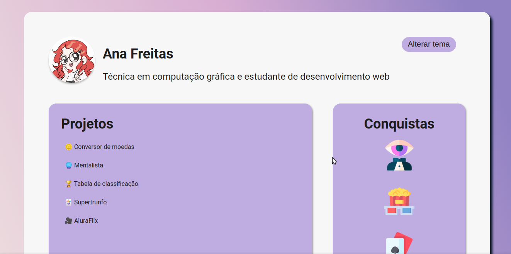

# Imersão dev alura

 
 

## 💻 Descrição:

Alguns projetos, como: calculadora de média, conversor de moedas, jogo super-trufo, etc, desenvolvidos durante a semana da Imersão dev da Alura e adaptados por mim.

## 🛠️ Tecnologias:

#  
## 🚀 Aprendizagem:

- HTML: tabelas.
- CSS: flexbox, dark mode.
- JAVASCRIPT: váriaveis, operadores, estrutura condicional, estrutura de repetição, array, funções, objetos.
